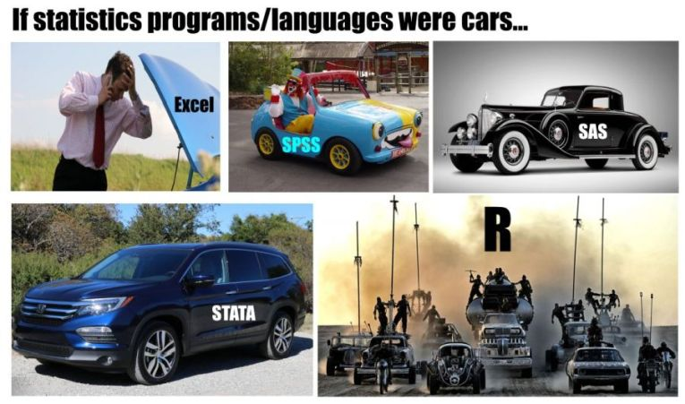
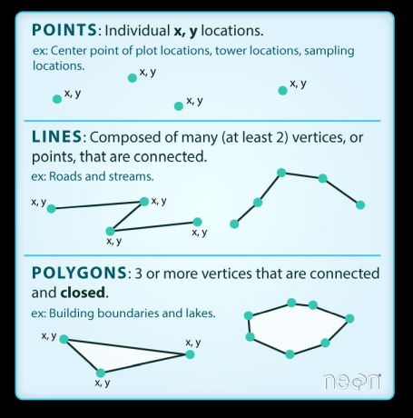
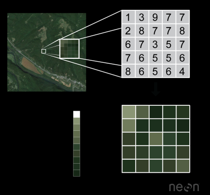

```{r setup, include=FALSE}
knitr::opts_chunk$set(echo = TRUE)

library(tidyverse)
library(sf)
library(tmap)
library(emo)
```

## Why analyse data?


## Setting things in context

- `r emo::ji("face_with_head_bandage")` patients admitted to hospital 

- `r emo::ji("taxi")` traffic in the city 

- `r emo::ji("selfie")` social media posts 

- `r emo::ji("cloud_with_lightning_and_rain")` weather patterns

- `r emo::ji("monkey")` animal movement 

- `r emo::ji("cherries")` agricultural output 

- `r emo::ji("computer")` pixels on images 


## Setting things in context

- `r emo::ji("face_with_head_bandage")` patients admitted to hospital `r emo::ji("globe_with_meridians")`

- `r emo::ji("taxi")` traffic in the city `r emo::ji("globe_with_meridians")`

- `r emo::ji("selfie")` social media posts `r emo::ji("globe_with_meridians")`

- `r emo::ji("cloud_with_lightning_and_rain")` weather patterns `r emo::ji("globe_with_meridians")`

- `r emo::ji("monkey")` animal movement `r emo::ji("globe_with_meridians")`

- `r emo::ji("cherries")` agricultural output `r emo::ji("globe_with_meridians")`

- `r emo::ji("computer")` pixels on images `r emo::ji("globe_with_meridians")`


## Why R spatial?




## Is my data spatial?

```{r, include=FALSE}
listings <- read_csv("./data/listings.csv")
```

```{r}
listings %>% select(-host_id) %>% slice(1:5)
```

## Is my data spatial?

```{r}
ggplot(listings, aes(x = longitude, y = latitude)) + geom_point()
```

## Is my data spatial?

```{r, include=FALSE}
SA2_2016_MELB <- st_read("./data/SA2_2016_MELB.shp")
```

```{r}
SA2_2016_MELB %>% select(-starts_with("SA4")) %>% slice(1:5)
```

## Is my data spatial?

```{r}
ggplot(SA2_2016_MELB) + geom_sf()
```

## What is special about spatial (1)?

```{r}
table(st_geometry_type(SA2_2016_MELB))
```

## Vector data



Image Source: NEON, via Data Carpentry


## Raster data



Image Source: NEON, via Data Carpentry


## What is special about spatial (2)?

```{r}
st_crs(SA2_2016_MELB)
```

> - ... allowing "every location on Earth to be specified by a set of numbers, letters or symbols" 

> - ... but "To specify a location on a plane requires a map projection." [Wikipedia](https://en.wikipedia.org/wiki/Geographic_coordinate_system)


## What we are going to cover 

- Read and manipulate spatial data
- Inspect tablar and spatial data
- Join tablar and spatial data
- Work with vector point and polygon data
- Create an interactive map

