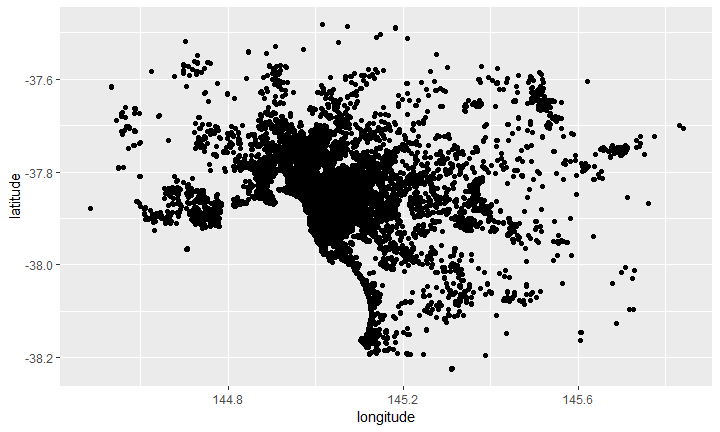
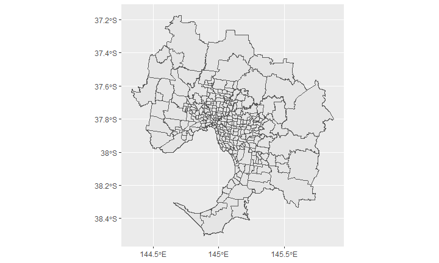
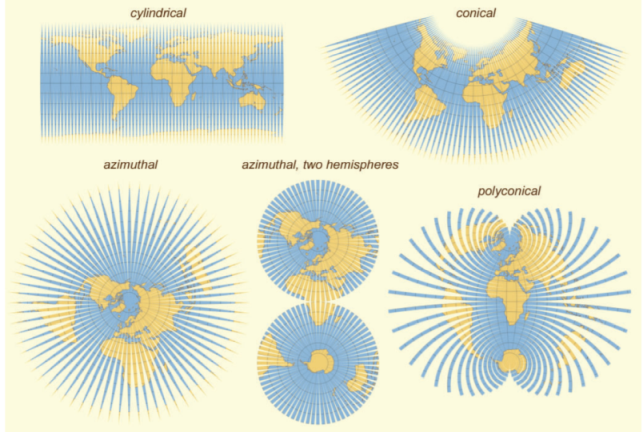

## Why analyse data?


## Why R?


## Setting things in context

- 🤕 patients admitted to hospital 

- 🚕 traffic in the city 

- 🤳 social media posts 

- ⛈ weather patterns

- 🐒 animal movement 

- 🍒 agricultural output 

- 💻 pixels on images 


## Setting things in context

- 🤕 patients admitted to hospital 🌐

- 🚕 traffic in the city 🌐

- 🤳 social media posts 🌐

- ⛈ weather patterns 🌐

- 🐒 animal movement 🌐

- 🍒 agricultural output 🌐

- 💻 pixels on images 🌐


## Is my data spatial?


```r
listings %>% select(-host_id) %>% slice(1:5)
```

```
## # A tibble: 5 x 8
##      id name     host_name neighbourhood latitude longitude room_type price
##   <dbl> <chr>    <chr>     <chr>            <dbl>     <dbl> <chr>     <dbl>
## 1  9835 Beautif~ Manju     Manningham       -37.8      145. Private ~    60
## 2 10803 Room in~ Lindsay   Moreland         -37.8      145. Private ~    35
## 3 12936 St Kild~ Frank & ~ Port Phillip     -37.9      145. Entire h~   159
## 4 15246 Large p~ Eleni     Darebin          -37.8      145. Private ~    50
## 5 16760 Melbour~ Colin     Port Phillip     -37.9      145. Private ~    69
```


## Is my data spatial?


```r
ggplot(listings, aes(x = longitude, y = latitude)) + geom_point()
```

<!-- -->


## Is my data spatial?


```r
SA2_2016_MELB %>% select(-starts_with("SA4")) %>% slice(1:5)
```

```
## Simple feature collection with 5 features and 2 fields
## geometry type:  MULTIPOLYGON
## dimension:      XY
## bbox:           xmin: 144.9267 ymin: -37.78021 xmax: 144.9869 ymax: -37.73251
## epsg (SRID):    NA
## proj4string:    +proj=longlat +ellps=GRS80 +no_defs
##   SA2_MAIN16        SA2_NAME16                       geometry
## 1  206011105         Brunswick MULTIPOLYGON (((144.9497 -3...
## 2  206011106    Brunswick East MULTIPOLYGON (((144.9734 -3...
## 3  206011107    Brunswick West MULTIPOLYGON (((144.9341 -3...
## 4  206011108            Coburg MULTIPOLYGON (((144.9485 -3...
## 5  206011109 Pascoe Vale South MULTIPOLYGON (((144.9326 -3...
```


## Is my data spatial?


```r
ggplot(SA2_2016_MELB) + geom_sf()
```

<!-- -->


## Vector data


Image Source: NEON, via Data Carpentry


## Raster data


Image Source: NEON, via Data Carpentry


## What is special about spatial (1)?


```r
st_crs(SA2_2016_MELB)
```

```
## Coordinate Reference System:
##   No EPSG code
##   proj4string: "+proj=longlat +ellps=GRS80 +no_defs"
```

> - ... allowing "every location on Earth to be specified by a set of numbers, letters or symbols" 

> - ... but "To specify a location on a plane requires a map projection." [Wikipedia](https://en.wikipedia.org/wiki/Geographic_coordinate_system)


## What is special about spatial (2)?



Image Source: van Wijk (2008)


## What we are going to cover 

- Read and manipulate spatial data
- Inspect tablar and spatial data
- Join tablar and spatial data
- Work with vector point and polygon data
- Create an interactive map

