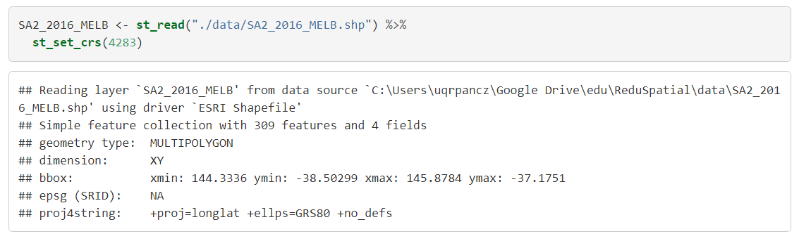

```{r setup, include=FALSE}
knitr::opts_chunk$set(echo = TRUE)
```

# Setting up for the course

## Open project & start a script

1. Open a project from  (**inside the `ReduSpatial-master` folder that you downloaded**).
2. Create a new R script : `File >> New File >> R Script` (or `Ctrl + Shift + N` keyboard shortcut).

## Conventions used in the materials

Materials in the course will mix R code, R output maps and graphs with some commentary in between.

Most importantly R code will appear in "code blocks" - grey boxes with colour coded syntax (highlighting elements of code, depending on their function) and R output will appear below them, also surrounded by boxes but without background:



Use the code from materials and copy paste it to your scripts. Use the output in materials to compare results inside your RStudio console or "Plots" or "Viewer" windows.

## Load the libraries

We will start our script with loading set of libraries that will allow us to read, manipulate and visualize spatial data. For the moment you can ignore the output.

```{r}
if (!require("tidyverse")) install.packages("tidyverse"); library("tidyverse")
if (!require("sf")) install.packages("sf"); library("sf")
if (!require("tmap")) install.packages("tmap"); library("tmap")
if (!require("sjmisc")) install.packages("sjmisc"); library("sjmisc")
```

We will work with four packages

- `tidyverse` - set of packages for data manipulation and graphs (contains `ggplot` and `dplyr`)
- `sf` simple features package to handle geographical data
- `tmap` mapping library
- `sjmisc` package for tabulating & summarizing data

# SA2 areas in Melbourne

## Background information  

An important piece of information when using spatial data is the geography to which it refers. ABS data are disseminated based on a number of geographies classified according to the Australian Statistical Geography Standard (ASGS). 


Mesh Blocks (MBs) are the smallest geographical areas defined. Due to confidentiality concerns however, data are more commonly analysed using units that are higher up the hierarchy - the Statistical Areas. Statistical Areas Level 2 (**SA2s**) are a common choice for small area analyses and ABS describes them as:

> designed to reflect functional areas that represent a community that interacts together socially and economically. They consider Suburb and Locality boundaries to improve the geographic coding of data to these areas and in major urban areas SA2s often reflect one or more related suburbs. The SA2 is the smallest area for the release of many ABS statistics, including the Estimated Resident Population (ERP), Health & Vitals and Building Approvals data. SA2s generally have a population range of 3,000 to 25,000 persons, and have an average population of about 10,000 persons. 

You can find more information about ASGS [here](abs.gov.au/websitedbs/D3310114.nsf/home/Australian+Statistical+Geography+Standard+(ASGS)). You can see how different geographies used by ABS fit (or not!) into each other on this interactive [map](http://stat.abs.gov.au/itt/r.jsp?ABSMaps). 

## Load spatial data

We will work with a subset of 2016 SA2 areas created by ABS. `sf` package function `st_read` will read data from a `SA2_2016_MELB.shp` file. After reading we will set up its coordinate system correctly with `st_set_crs`.

```{r}
SA2_2016_MELB <- st_read("./data/SA2_2016_MELB.shp") %>% 
  st_set_crs(4283)
```

Pay attention to special characters used in the code block:

- we use `<-` as "assignment"" to create `SA2_2016_MELB` object
- we use "pipe"" `%>%` to pass the object for further opearations, in our case - defining a projection; easy way to think about pipes is to read them to yourself as "then"

You can easily recognize functions coming from `sf` package with a `st_` prefix. Remaining part tries to describe what a function does, most likely using a verb.

Our input data comes from `SA2_2016_MELB.shp` file. This is a shapefile which is a common format for storing and sharing geospatial data. Shapefile is actually a collection of minimum three files. Take a look into `.\ReduSpatial\data` directory and search for it. Read more about shapefile on the [Wikipedia page](https://en.wikipedia.org/wiki/Shapefile).

## Examine spatial data

Lets create first map. We will use `tmap` library to help us out. We first set up "mode" to "view (which means interactive map"):

```{r}
tmap_mode("view")
```

Then, use `qtm` function to show boundaries of SA2 areas:

```{r}
qtm(SA2_2016_MELB)
```

This is a simple map representing Statistical Area Level 2 (SA2) polygons overlaid on some background maps. Click around your "Viewer" panel - this is an interactive map that allows you zooming in and out, identify region and change background maps. See if you can find buttons that let you export the map, move it to spearate window or change background maps.

Let's check what kind of geometry we have in our data:

```{r}
table(droplevels(st_geometry_type(SA2_2016_MELB)))
```

And what type of projection system it is in:

```{r}
st_crs(SA2_2016_MELB)
```

Our is Coordinate Reference System has a code `EPSG: 4283`. That means our data are using `Geocentric_Datum_of_Australia_1994` (more (details)[https://epsg.io/4283]). 

## Examine attributes

Let's use few R functions to check how the dataset is structured. We can use functions of R to dexcribe how many rows dataset has:  

```{r}
nrow(SA2_2016_MELB)
```

What are the names of the data:

```{r}
names(SA2_2016_MELB)
```

Show first five rows:

```{r}
slice(SA2_2016_MELB, 1:5)
```

And examine structure of data in more detail:

```{r}
str(SA2_2016_MELB)
```

We can plot our date and overlay them with other maps but there is very little information contained there apart from the boundaries and their names. We will link other data to our polygons that will let us describe places. 

# SEIFA indices 

## Background information 

We will work with data from Austrlian Bureau of Statistics (ABS) that describe geographical areas using set of Census 2016 indicators. We will use Socio-Economic Indexes for Areas (SEIFA):

> an ABS product that ranks areas in Australia according to relative socio-economic advantage and disadvantage. SEIFA 2016 has been created from Census 2016 data and consists of four indexes: The Index of Relative Socio-economic Disadvantage (IRSD); The Index of Relative Socio-economic Advantage and Disadvantage (IRSAD); The Index of Education and Occupation (IEO); The Index of Economic Resources (IER).


More information and the data can be found [here](http://www.abs.gov.au/AUSSTATS/abs@.nsf/Lookup/2033.0.55.001Main+Features12016?OpenDocument).


## Load data

We will load one more dataset. This dataset is not a spatial dataset and is saved in R's `Rds` format so we can read it using `readRDS` function.

```{r}
SEIFA <- readRDS("data/SEIFA.Rds")
```

## Examine data

Lets again examine the data using thesame functions we used to learn more about SA2 areas (output omitted):

```{r, eval=FALSE}
nrow(SEIFA)
names(SEIFA)
slice(SEIFA, 1:5)
str(SEIFA)
```

## Examine variables with summary statistics

Instead of looking at the whole data frame, we can select individual variables. We use `descr` function from `sjmisc` package to return few descriptive statistics on IRSAD score:

```{r}
descr(SEIFA, IRSAD_s)
```

and deciles:

```{r}
descr(SEIFA, IRSAD_d)
```

It might be more informative to look at the frequencies of deciles instead of summary statistics:

```{r}
frq(SEIFA, IRSAD_d)
```

Finally, using pipes and `dplyr` functions to sort and group data we can combine two variables together and look at descriptive statistics of score for each decile if IRSAD:

```{r}
SEIFA %>%
  arrange(IRSAD_d) %>%
  group_by(IRSAD_d) %>%
  descr(IRSAD_s)
```

## Examine variables with graphs

A picture is (sometimes) worth a thousand words so it might be easier to look at your variables and relation between them using graphs. Lets look at the histogram of score:

```{r}
ggplot(SEIFA, aes(IRSAD_s)) + geom_histogram()
```

Here is the bar chart showin frequency of data across deciles:

```{r}
ggplot(SEIFA, aes(IRSAD_d)) + geom_bar()
```

And lastly, box plot describing score across deciles:

```{r}
ggplot(SEIFA, aes(as.factor(IRSAD_d), IRSAD_s)) + geom_boxplot()
```

Pay attention to warning! They do not stop the execution of your code but provide you with some hints when uexpected behaviour. Use `View(SEIFA)` to open data frame and browse through it. Can you spot the problem that caused the warning?

## Linking geography and attributes

We have now two separate objects in our R session. You can see them in your "Environment" tab. We will now join them together using `left_join` function from `dplyr` package:

```{r}
SA2_SEIFA <- left_join(SA2_2016_MELB, SEIFA, by = c("SA2_MAIN16", "SA2_MAIN16"))
```

`SA2_2016_MELB` simple features object can be manipulated in the same way as every data frame. We merged data from `SEIFA` data frame using common variable `SA2_MAIN16`. Technically we wouldn't have to specify the "key" used to merge data because it has the same name in both sources but you might need that functionalty if names are different.

Use `nrow` function (or peek into your "Environment" tab) to check how many rows each of our datasets has now. Use `help(left_join)` command (or manual search) in your "Help" panel to find help about the `left_join` function. Can you realte it to the output of `nrow`?

One important thing to check before any further work with merged data is to check if your data has missing information. We can do it by tabulating output of `is.na` function ("NA" stands for missing data):

```{r}
table(is.na(SA2_SEIFA$IRSAD_s))
```

We have some areas with missing information. `filter`ing them to a `qtm` map can provide some insights about why there are missing:

```{r}
SA2_SEIFA %>% 
  filter(is.na(IRSAD_s)) %>% 
  qtm(fill = "red", 
      fill.alpha = 0.5, border = NULL)
```

Can you guess why theseareas do not have SEIFA scores?

## Saving your data

We put a lot of work to get data in good shape. They will be used in second part of tutorial so we save them using `saveRDS` function:

```{r}
saveRDS(SA2_SEIFA, "data/SA2_SEIFA.Rds")
```

# Further topics

1. Examine SEIFA indices for Melbourne in the same manner as you did for the whole Austrlia (section "Examine data"). What differences do you see? How could you explain them?

2. Examine relationships between two different indices for Autralia or Melbourne. What kind of graphs and statistics could be useful here?


