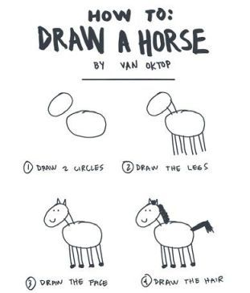

## Styling your geographic data

  

## Styling your geographic data

  

  

## Interactive and static maps

## Cartography basics - color

## Cartography basics - map type

## Small multiples

## What we are going to cover 

- Read, create and manipulate spatial data
- Work with vector polygon data
- Improve an interactive map
- Create a static map
- Learn basics of cartography 
