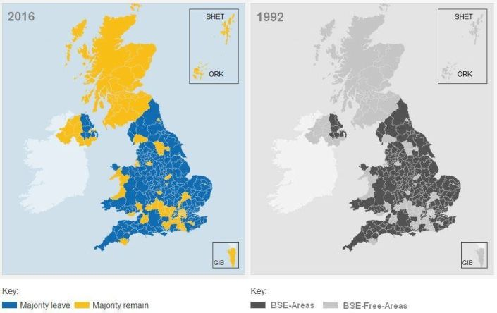

```{r setup, include=FALSE}
knitr::opts_chunk$set(echo = TRUE)

library(tidyverse)
library(sf)
library(tmap)
library(emo)
```


## Simplifying patterns 


## Aggregating data

Simplifying by reducing complexity of the data


## Changing representation

Simplifying by changing representation

https://en.wikipedia.org/wiki/File:Bivariate_example.png


## Finding relationship 




## What we are going to cover 

- Read, create and manipulate spatial data
- Work with vector point data
- Convert point data into different representations
- Learn about spatial joins
