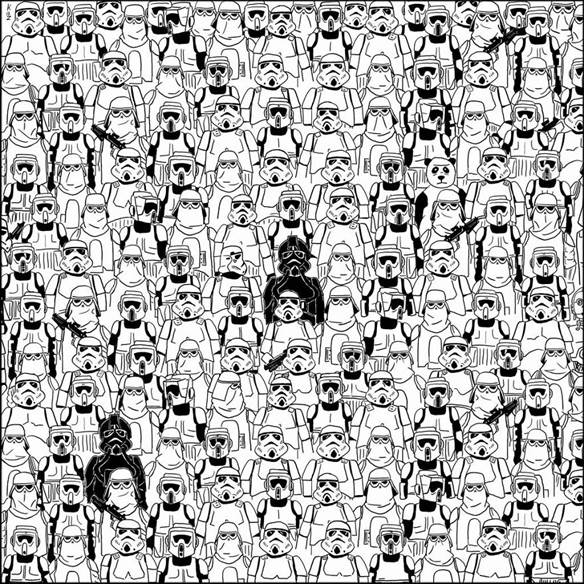
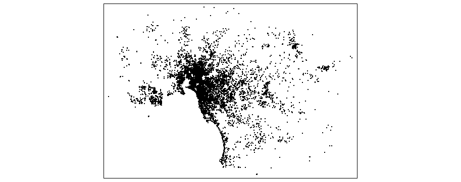
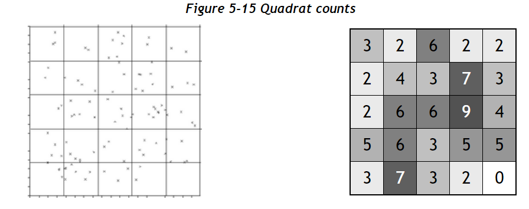
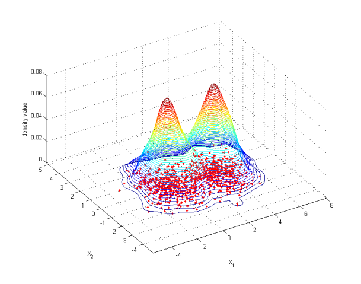

## Simplifying patterns 

## Way too many points 

## Aggregating data

Source [Geospatial Analysis](https://www.spatialanalysisonline.com/HTML/index.html?quadrat_analysis_of_grid_datas.htm)

## Changing representation

Source [Wikipedia](https://en.wikipedia.org/wiki/File:Bivariate_example.png)

## Finding relationship 

## What we are going to cover 

- Read, create and manipulate spatial data
- Work with vector point data
- Convert data into different representations
- Learn about spatial joins
