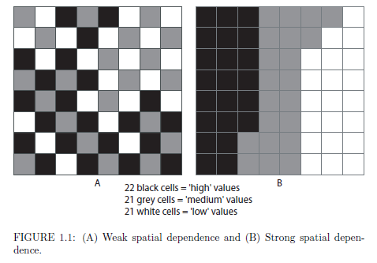
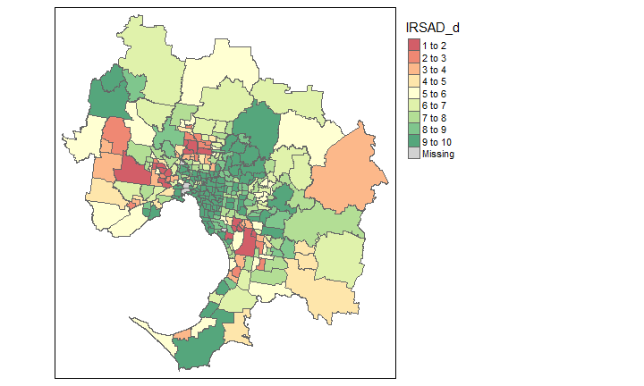
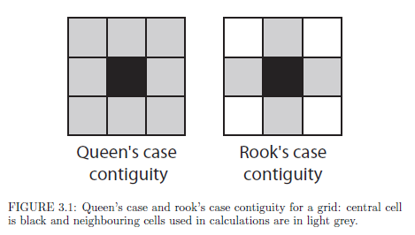

## Mapping vs. analysis

## Spatial dependence - theory

Source: Lloyd, 2011

## Spatial dependence - practice

<!-- -->

## Neighbours - theory

Source: Lloyd, 2011

## Neighbours - practice

<!-- -->

## Global autocorrelation 

Image: [arcgis](https://pro.arcgis.com/en/pro-app/tool-reference/spatial-statistics/cluster-and-outlier-analysis-anselin-local-moran-s.htm)

Moran, P (1950) Notes on Continuous Stochastic Phenomena. *Biometrika*, 37(1-2): 17-23.

## Local autocorrelation 

Image: [arcgis](https://pro.arcgis.com/en/pro-app/tool-reference/spatial-statistics/cluster-and-outlier-analysis-anselin-local-moran-s.htm)

Anselin, L (1995) "Local Indicators of Spatial Association—LISA," Geographical Analysis, 27(2): 93–115.

## What we are going to cover 

- Learn about alternative way of representing spatial data in R
- Explore spatial correlation
- Search for clusters and hotspots 
- Determine significance of results
