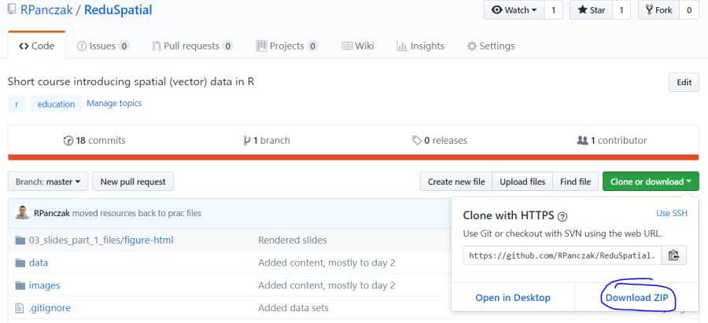
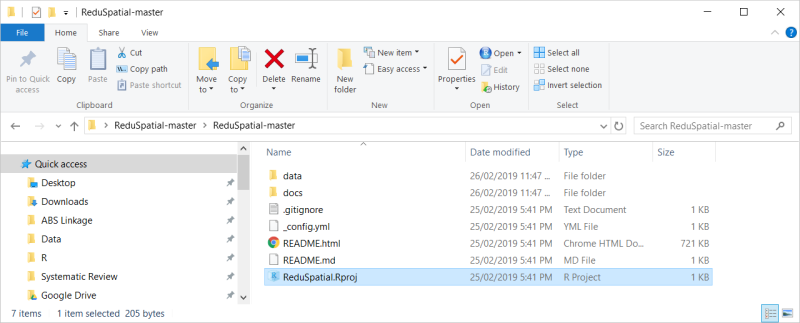

```{r setup, include=FALSE}
knitr::opts_chunk$set(echo = TRUE)

knitr::opts_knit$set(root.dir = rprojroot::find_rstudio_root_file())

library(tidyverse)
library(sf)
library(tmap)
library(emo)
```


## Why analyse data?


## Why R?


## Setting things in context

- `r emo::ji("face_with_head_bandage")` patients admitted to hospital 

- `r emo::ji("taxi")` traffic in the city 

- `r emo::ji("selfie")` social media posts 

- `r emo::ji("cloud_with_lightning_and_rain")` weather patterns

- `r emo::ji("monkey")` animal movement 

- `r emo::ji("cherries")` agricultural output 

- `r emo::ji("computer")` pixels on images 


## Setting things in context

- `r emo::ji("face_with_head_bandage")` patients admitted to hospital `r emo::ji("globe_with_meridians")`

- `r emo::ji("taxi")` traffic in the city `r emo::ji("globe_with_meridians")`

- `r emo::ji("selfie")` social media posts `r emo::ji("globe_with_meridians")`

- `r emo::ji("cloud_with_lightning_and_rain")` weather patterns `r emo::ji("globe_with_meridians")`

- `r emo::ji("monkey")` animal movement `r emo::ji("globe_with_meridians")`

- `r emo::ji("cherries")` agricultural output `r emo::ji("globe_with_meridians")`

- `r emo::ji("computer")` pixels on images `r emo::ji("globe_with_meridians")`


## Is my data spatial?

```{r, include=FALSE}
listings <- read_csv("./data/listings.csv")
```

```{r}
listings %>% select(-host_id) %>% slice(1:5)
```


## Is my data spatial?

```{r}
ggplot(listings, aes(x = longitude, y = latitude)) + geom_point()
```


## Is my data spatial?

```{r, include=FALSE}
SA2_2016_MELB <- st_read("./data/SA2_2016_MELB.shp") %>% 
  st_set_crs(4283)
```

```{r}
SA2_2016_MELB %>% select(-starts_with("SA4")) %>% slice(1:5)
```


## Is my data spatial?

```{r}
ggplot(SA2_2016_MELB) + geom_sf()
```


## Vector data


Image Source: NEON, via Data Carpentry


## Raster data


Image Source: NEON, via Data Carpentry


## What is special about spatial (1)?

```{r}
st_crs(SA2_2016_MELB)
```

> - ... allowing "every location on Earth to be specified by a set of numbers, letters or symbols" 

> - ... but "To specify a location on a plane requires a map projection." [Wikipedia](https://en.wikipedia.org/wiki/Geographic_coordinate_system)


## What is special about spatial (2)?


Image Source: van Wijk (2008)


## What we are going to cover 

- Read and manipulate data
- Inspect and summarize data
- Join data from two sources
- Work with vector polygon data
- Create an interactive map
- Search for help

## Setting up (1)

https://github.com/RPanczak/ReduSpatial



## Setting up (2)

In RStudio: `File >> Open Project...` <br />
Choose `ReduSpatial.Rproj` file.



