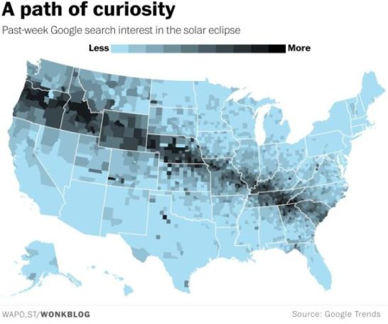

## Styling your geographic data

## Cartography basics - visual variables

Source [axismaps](https://www.axismaps.com/guide/general/visual-variables/)

## Cartography basics - map type

Source [reddit](https://www.reddit.com/r/MapPorn/comments/6r0ea6/pastweek_google_search_interest_in_the_solar/)

## Cartography basics - color

Source [axismaps](https://www.axismaps.com/guide/general/using-colors-on-maps/)

## Cartography basics - classes

Source [kaitlyncoleman22](https://kaitlyncoleman22.wordpress.com/2015/11/21/lab-6-data-classification-choropleth-mapping/)

## Interactive and static maps

## What we are going to cover 

- Create an interactive map
- Create a static map
- Learn basics of cartography 