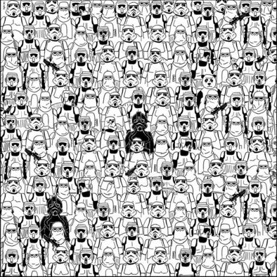

## Simplifying patterns 

## Way too many points 

## Aggregating data

Source [Geospatial Analysis](https://www.spatialanalysisonline.com/HTML/index.html?quadrat_analysis_of_grid_datas.htm)

## Changing representation

Source [Wikipedia](https://en.wikipedia.org/wiki/File:Bivariate_example.png)

## Finding relationship 

## What we are going to cover 

- Create and manipulate spatial point and polygon data
- Convert data into different representations
- Aggregate counts of points
- Summarize density of variable 
- Learn about spatial joins

## Setting up (1)

Download and unzip

https://is.gd/spatialcourse

## Setting up (2)

In RStudio: `File >> Open Project...`  
Choose `ReduSpatial.Rproj` file.

