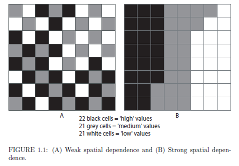
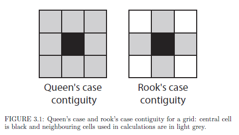

```{r include=FALSE}
knitr::opts_chunk$set(echo = FALSE)

set.seed(1234)

if (!require("tidyverse")) install.packages("tidyverse"); library("tidyverse")
if (!require("sf")) install.packages("sf"); library("sf")
if (!require("tmap")) install.packages("tmap"); library("tmap")
if (!require("spdep")) install.packages("spdep"); library("spdep")

tmap_mode("plot")
```

## Mapping vs. analysis


## Spatial dependence - theory



Source: Lloyd, 2011


## Spatial dependence - practice

```{r}
SA2_SEIFA <- readRDS("data/SA2_SEIFA.Rds")

tm_shape(SA2_SEIFA) +
  tm_polygons(col = "IRSAD_d", 
              n = 10, alpha = 0.7, palette = "RdYlGn", lwd = 0) +
  tm_layout(legend.outside = TRUE)
```

## Neighbours - theory



Source: Lloyd, 2011


## Neighbours - practice

```{r}
SA2_SEIFA_proj <- SA2_SEIFA %>% 
  st_transform(3112) %>% 
  filter(!is.na(IRSAD_s)) %>% 
  as("Spatial")

SA2_weights_queen <- poly2nb(SA2_SEIFA_proj, queen = TRUE)
SA2_weights_queen_list <- nb2listw(SA2_weights_queen, style="W", zero.policy=TRUE)

op <- par(mar = rep(0, 4))

plot(SA2_SEIFA_proj, border = "grey60")
plot(SA2_weights_queen, coordinates(SA2_SEIFA_proj), pch = 19, cex = 0.6, add = TRUE)
```


## Global autocorrelation 


Image: [arcgis](https://pro.arcgis.com/en/pro-app/tool-reference/spatial-statistics/cluster-and-outlier-analysis-anselin-local-moran-s.htm)

Moran, P (1950) Notes on Continuous Stochastic Phenomena. *Biometrika*, 37(1-2): 17-23.


## Local autocorrelation 


Image: [arcgis](https://pro.arcgis.com/en/pro-app/tool-reference/spatial-statistics/cluster-and-outlier-analysis-anselin-local-moran-s.htm)

Anselin, L (1995) "Local Indicators of Spatial Association—LISA," Geographical Analysis, 27(2): 93–115.


## What we are going to cover 

- Learn about alternative way of representing spatial data in R
- Explore spatial correlation
- Search for clusters and hotspots 
- Determine significance of results
